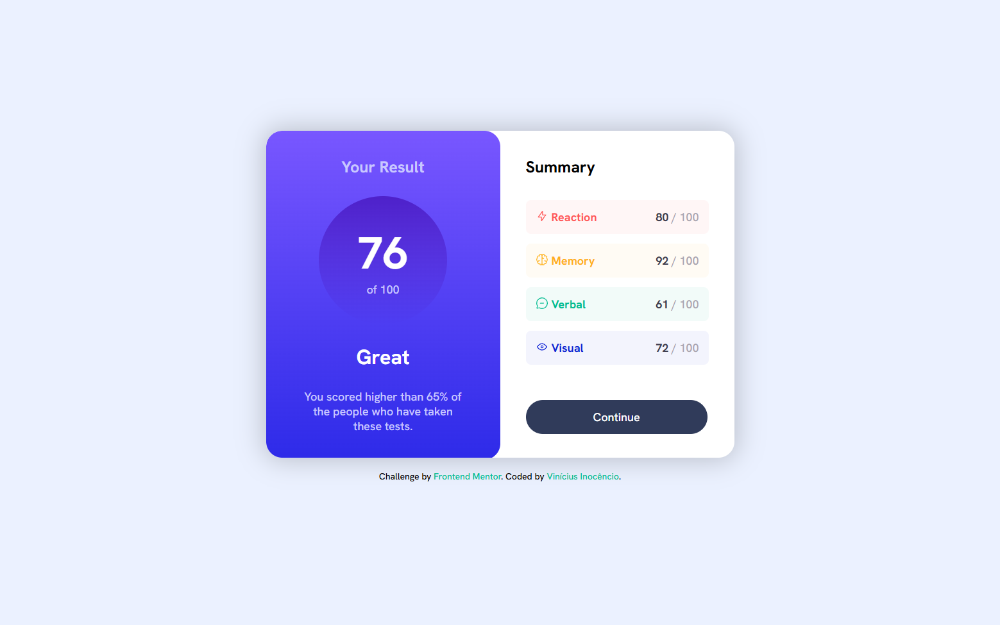
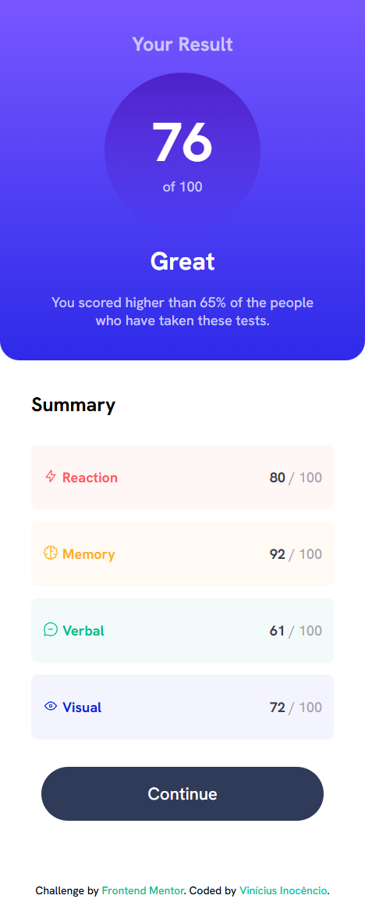

# 📊 Results Summary Component

Uma pequena interface que exibe o resultado de um teste com média geral e desempenho por categorias — **Reaction**, **Memory**, **Verbal** e **Visual**. Projeto com layout responsivo e foco em boas práticas de HTML e CSS.

---

## 📌 Descrição

Este projeto foi desenvolvido como parte de um desafio da **Frontend Mentor** com o objetivo de treinar a criação de **componentes visuais reutilizáveis** e **organização de conteúdo**. A interface foi construída utilizando **HTML semântico**, além de técnicas de **estilização com CSS**, incluindo **Flexbox**, **cores variáveis por categoria** e responsividade com **media queries**.

---

## ⚙️ Funcionalidades

- Layout estruturado com `HTML5` semântico
- Estilização com `CSS3` (cores temáticas, tipografia, espaçamento)
- Responsividade adaptada para dispositivos menores

---

## 🛠️ Tecnologias

- HTML5
- CSS3

---

## 🖥️ Resultado

### 💻 Versão Desktop

### 📱 Versão Mobile

---

🔗 [**Clique aqui para visualizar o projeto no GitHub Pages**](https://inocenciooo.github.io/results-summary-component-main)

---

## 💬 Contribuições

Este projeto faz parte da minha jornada de aprendizado em **desenvolvimento front-end**. Fique à vontade para sugerir melhorias, abrir issues ou contribuir com o código!
